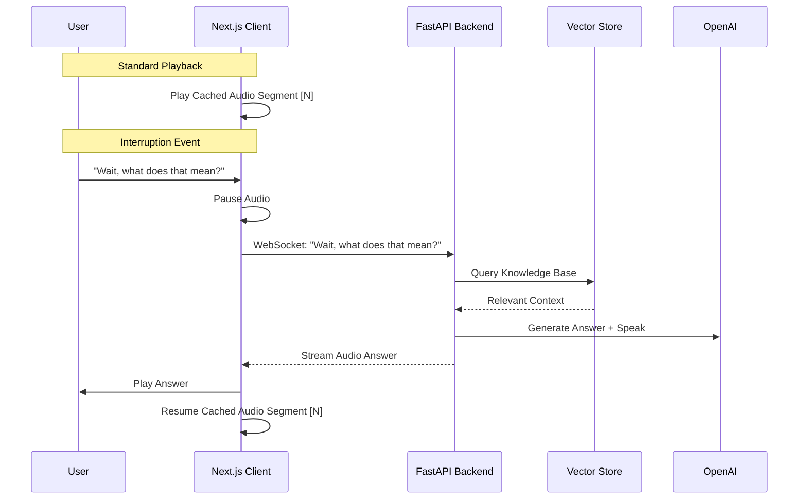

# awdio

**Next-Generation Voice-Driven Podcast & Presentation Platform**

`awdio` is an experimental platform designed to reimagine how we consume and interact with audio content. It moves beyond static audio files to create dynamic, living presentations that listeners can interrupt, question, and explore in real-time using voice.

## Vision

The core philosophy of `awdio` (Awe + Audio) is that audio should be a conversation, not a broadcast. Whether it's a corporate presentation, an educational podcast, or an interactive survey, the user should have the agency to stop the flow, ask for clarification, or dive deeper into a specific topic—just as they would in a live room.

By combining high-fidelity pre-generated content with low-latency conversational AI, `awdio` delivers a "best of both worlds" experience: the production quality of a studio recording with the interactivity of a live agent.

## Core Capabilities

1.  **AI-Generated Content**: Automatically converts documents (PDFs, text) into engaging multi-speaker scripts and high-fidelity audio podcasts.
2.  **Voice-First Interaction**: Users interact primarily through voice. The interface is minimal, dark, and designed to minimize cognitive load, focusing purely on the audio experience.
3.  **Real-Time Interruption**: Listeners can interrupt the stream at any moment. The system handles the interruption gracefully, answers the question using RAG (Retrieval-Augmented Generation), and resumes the presentation seamlessly.
4.  **Admin Knowledge Graph**: Administrators can curate Knowledge Bases that feed the AI, ensuring that answers are grounded in specific, truthful documents rather than general LLM hallucinations.

## Architectural Design Pattern: "Segmented Composition"

One of the critical challenges in generative audio is balancing **cost** (generation fees), **latency** (time to speak), and **quality** (human-like prosody). `awdio` employs a novel design pattern called **Segmented Composition with JIT Bridging**:

1.  **Static Pre-Generation (The "Base Layer")**:
    - When a podcast is created, the system generates the entire script and synthesizes high-quality audio for every segment *once*.
    - These segments are cached (S3/Object Store).
    - **Benefit**: Zero latency for the main track, fixed cost regardless of playback count, and highest possible audio quality.

2.  **Dynamic Interruption (The "Live Layer")**:
    - When a user interrupts, the client performs Voice Activity Detection (VAD) and pauses the Base Layer.
    - The question is sent to the **Agent Service**, which queries the RAG Knowledge Base.
    - An answer is generated and synthesized on-the-fly (Just-In-Time).
    - **Benefit**: True interactivity without generating the entire 30-minute podcast dynamically for every user.

3.  **Contextual Bridging**:
    - Before resuming the Base Layer, the Agent can optionally generate a "bridge" sentence (e.g., *"Great question. Now, returning to our discussion on..."*) to smooth the transition back to the pre-recorded content.

## Technical Architecture

The system is built as a set of containerized microservices:

### 1. Frontend (The User Experience)
- **Framework**: Next.js (React)
- **Styling**: Tailwind CSS (Dark Mode focused)
- **Role**:
    - Renders the "Fantastic" minimal UI.
    - Manages audio playback state (sequencing segments).
    - Visualizes audio (waveforms) to indicate "Listening" vs "Speaking" states.
    - Handles WebSocket connections for low-latency agent interaction.

### 2. Backend API (The Logic Layer)
- **Framework**: FastAPI (Python)
- **Role**:
    - Exposes REST endpoints for Admin management (Content Upload, Script Generation).
    - Manages the WebSocket server for real-time agent communication.
    - Orchestrates the RAG pipeline.

### 3. AI & Data Services
- **Vector Store**: ChromaDB (stores document embeddings for RAG).
- **LLM Provider**: OpenAI GPT-4o (Script generation & Question Answering).
- **Audio Synthesis**: Hybrid pipeline supporting **Neuphonic** (low latency) and **ElevenLabs** (high fidelity).
- **Database**: PostgreSQL (stores Scripts, Knowledge Base metadata, and User sessions).

## Data Flow

## Future Roadmap

- **GraphRAG**: Implementing Knowledge Graphs for deeper reasoning connections between disjoint documents.
- **Vision Integration**: "Show, don't just tell" - synchronized slide generation during the presentation.
- **Biometric Feedback**: Adjusting pacing/complexity based on user engagement signals.
- **Local LLM Support**: Running entirely offline for privacy-sensitive deployments.
